# Terraform for AWS (EN)

**Notes:**

- Use `_` instead `-` in Terraform by default
- AWS free tier: `t2.micro`


## Configure AWS

- IAM
  - Add a new user
  - Permissions

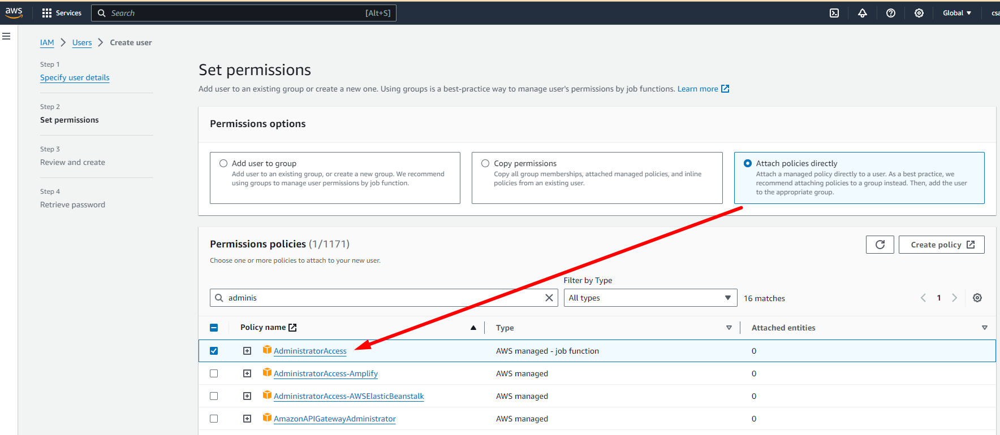


## AWS CLI

https://docs.aws.amazon.com/cli/latest/userguide/getting-started-install.html


### Configure AWS Cli

https://docs.aws.amazon.com/cli/latest/userguide/getting-started-quickstart.html

```bash
aws configure sso
```

**or**

#### Create an Access Key (Alternative)

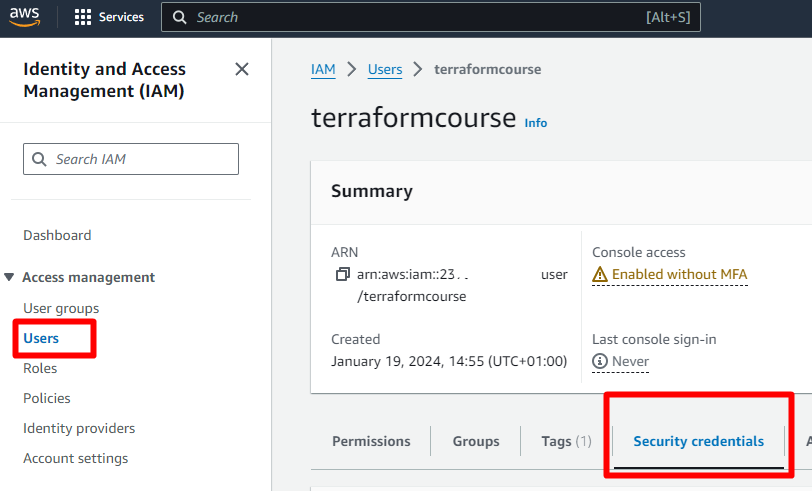

"Create access key" button In **Access keys** section.

```bash
$> aws configure

# AWS Access Key ID [None]: <KEY>
# AWS Secret Access Key [None]: <SECRET>
# Default region name [None]: eu-west-3
# Default output format [None]:
```


### Check AWS login

```bash
aws sts get-caller-identity
```

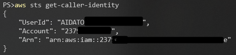


## Terraform Basics

1. Access the AWS Console
2. Create folder and first Terraform file
3. Instantiate the AWS Provider
4. Different Authentication methods
5. Creating the Server
6. Modify the startup script
7. Modify the Security Group
8. Rename the server
9. Destroy the server and associated resources


### Access the AWS Console

Access to EC2 section in the AWS console

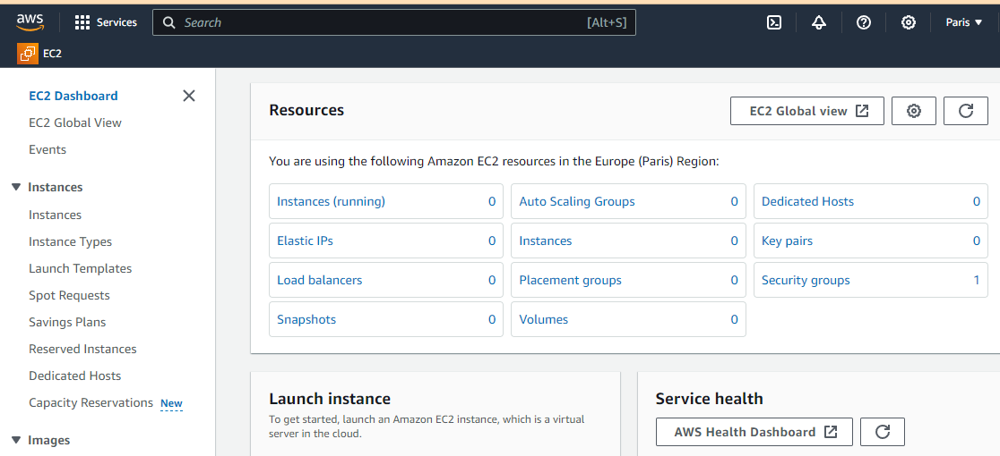


### Create folder and first Terraform file

```powershell
mkdir my-first-server; cd my-first-server
```

Open this folder with `Visual Studio Code`, `WebStorm` or similar.

Create the `main.tf` file

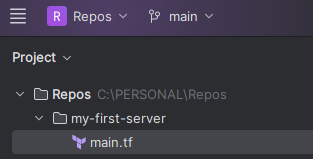

*Usually the main file in terraform is named `main.tf`*


### Instantiate the AWS Provider

Official Documentation: https://registry.terraform.io/providers/hashicorp/aws/latest/docs

*What is the Terraform provider?*

A Terraform provider is a plugin that Terraform uses to interact with a specific service or infrastructure provider, like AWS in this case. Providers are responsible for understanding API interactions and exposing resources. The AWS provider in Terraform allows you to manage AWS resources such as EC2 instances, S3 buckets, IAM policies, and more.

To use the AWS provider in Terraform, you need to declare it in your Terraform configuration. This typically involves specifying the provider name (`aws`) and optionally, configuration details like the region.

Into `main.tf` file write this:

```hcl
provider "aws" {
  region = "eu-west-3"
}
```

This code initializes the AWS provider and sets the region to `eu-west-3` (*mandatory*). After declaring the provider, you can start defining AWS resources in your Terraform configuration.


### Different Authentication methods

Official documentation: https://registry.terraform.io/providers/hashicorp/aws/latest/docs#authentication

- Static Credentials (**Not recommended**)

```json
provider "aws" {
  region     = "us-west-2"
  access_key = "my-access-key"
  secret_key = "my-secret-key"
}
```


- AWS Credentials file

https://registry.terraform.io/providers/hashicorp/aws/latest/docs#shared-configuration-and-credentials-files

The AWS Provider can source credentials and other settings from the [shared configuration and credentials files](https://docs.aws.amazon.com/cli/latest/userguide/cli-configure-files.html). By default, these files are located at `$HOME/.aws/config` and `$HOME/.aws/credentials` on Linux and macOS, and `"%USERPROFILE%\.aws\config"` and `"%USERPROFILE%\.aws\credentials"` on Windows.

**Windows**

```powershell
cat "$HOME\.aws\credentials"
```

```plaintext
[default]
aws_access_key_id = <...KEY...>
aws_secret_access_key = <...SECRET...>
```


### Creating the Server

Vamos a crear en main.tf un resource, es el componente donde vamos a definir el elemento que queremos crear, en este caso en AWS.

*Example:*

```json
provider "aws" {
  region = "eu-west-3"
}

resource "aws_instance" "my_first_server" {
    ami = ""
    instance_type = "t2.micro"
    tags = {
        Name = "my_first_server"
    }
}
```


- Check the official documentation to get the basic information to deploy this resource.
- We don´t know what´s the `ami`
  - This is the AWS image identifier of the operating system we want to deploy
  - Get the `ami` using the AWS console
  - **Check available images**

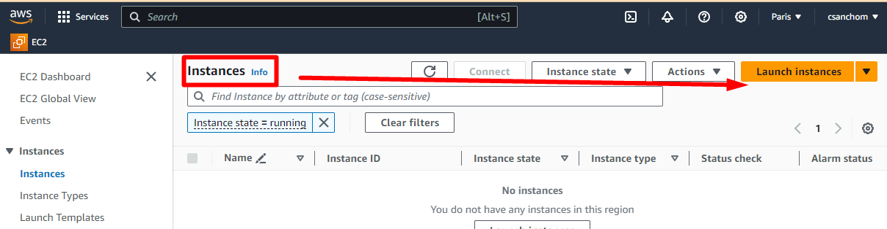

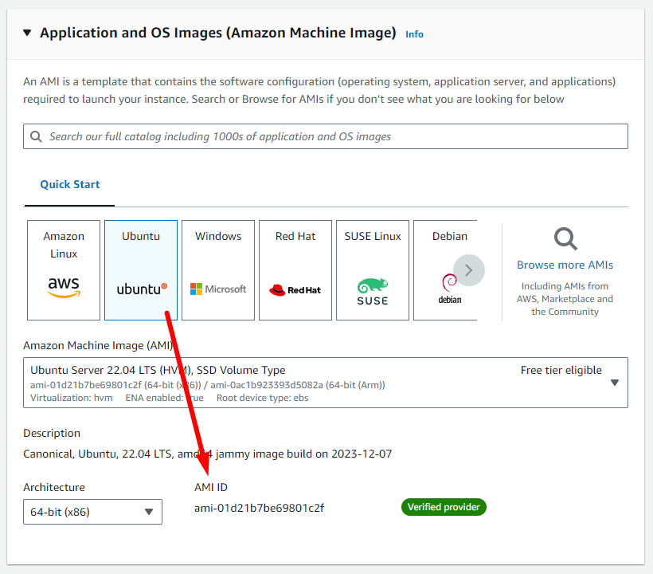

Copy the **AMI ID**

Update the `main.tf`

```json
provider "aws" {
  region = "eu-west-3"
}

resource "aws_instance" "my_first_server" {
    ami = "ami-01d21b7be69801c2f"
    # Free tier
    instance_type = "t2.micro"
    tags = {
        Name = "my_first_server"
    }
}
```

As we have logged in with AWS, we can start the deployment process.

### Terrafom Init

```powershell
terraform init
```

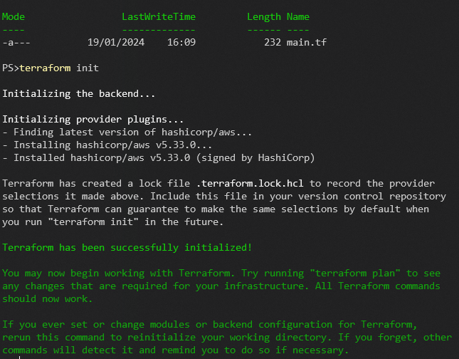

What´s doing?

1. Terraform will get all the defined providers
2. Since the providers are terraforming plugins, terraform will download the specific plugin for the declared infrastructure, AWS in this case.


### Terraform Plan

The `terraform plan` command is a crucial part of the Terraform workflow. It performs several key functions:

1. **Reads the Configuration**: It examines all `.tf` files in the directory to understand the desired state of your infrastructure as defined by your Terraform configuration.
2. **State Comparison**: Compares the desired state with the current state of your infrastructure. The current state is either stored in a local `terraform.tfstate` file or remotely. If it's the first run, or no resources are deployed, the current state is essentially empty.
3. **Dependency Analysis**: Determines dependencies between resources to construct an execution plan ensuring resources are created or modified in the correct order.
4. **Generates an Execution Plan**: Outputs a plan showing what actions Terraform will take to move from the current state to the desired state. This can be new resources to create, existing resources to modify, or unwanted resources to destroy.
5. **Provides a Preview**: Before any changes are made, it presents this plan for review. This step ensures visibility and control over changes that will be applied to your infrastructure.

The `terraform plan` **does not make any changes to the actual infrastructure**. It provides a safety mechanism to review and verify changes before applying them with `terraform apply`.

Diagram of `Terraform Plan` Process:

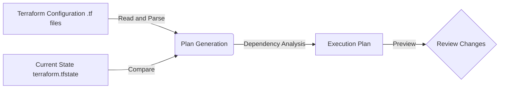

*Example:*

```powershell
terraform plan
```

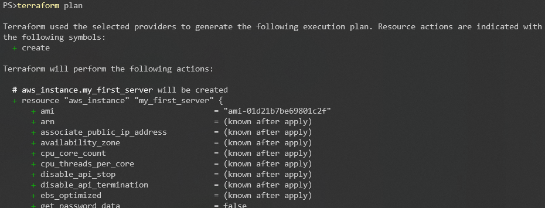


### Terraform Apply

The `terraform apply` command is a critical operation in Terraform, responsible for actualizing the infrastructure changes. It performs several important steps:

1. **Executes the Plan**: It either automatically generates a new execution plan (like `terraform plan`) or applies a saved plan file. This plan details what actions Terraform will take to transition the current state of your infrastructure to the desired state.
2. **Resource Provisioning**: For each resource that needs creation, modification, or deletion, `terraform apply` interacts with the respective cloud provider's API (e.g., AWS, Azure, GCP) to make these changes.
3. **State Update**: After applying the changes, Terraform updates the `terraform.tfstate` file. This file tracks the state of your managed infrastructure and configurations, ensuring Terraform's awareness of the changes it has made.
4. **Outputs**: Upon completion, it displays the outcomes of the applied changes. If the configuration includes output variables, these are displayed, providing useful information such as public IP addresses, hostnames, etc.
5. **Error Handling**: If errors occur during the application of the plan, Terraform attempts to provide meaningful error messages and partially updates the state file to reflect any successful changes.

The `terraform apply` command is the point at which Terraform makes actual changes to your infrastructure, making it a critical step that should be preceded by careful review of the plan generated by `terraform plan`.

Diagram of `Terraform Apply` Process:

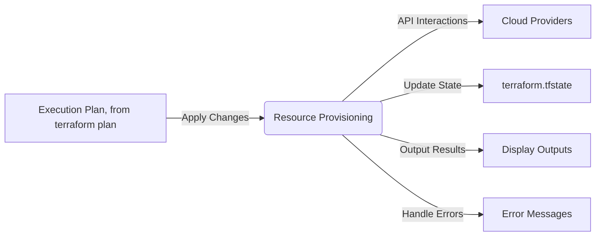

This diagram represents the flow from using the execution plan, provisioning resources through API interactions, updating the state file, displaying outputs, and handling any potential errors.

*Example*

```powershell
terraform apply
```

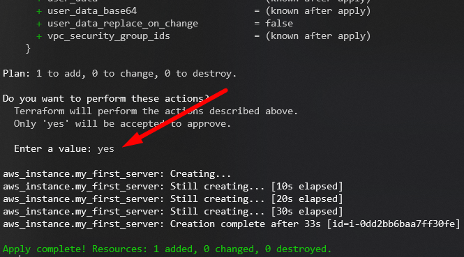

At this point this instance does nothing.
Let's see how to deploy a web server to display a message when accessing a URL


### Modify the startup script

### Modify the Security Group

### Rename the server

### Destroy the server and associated resources


